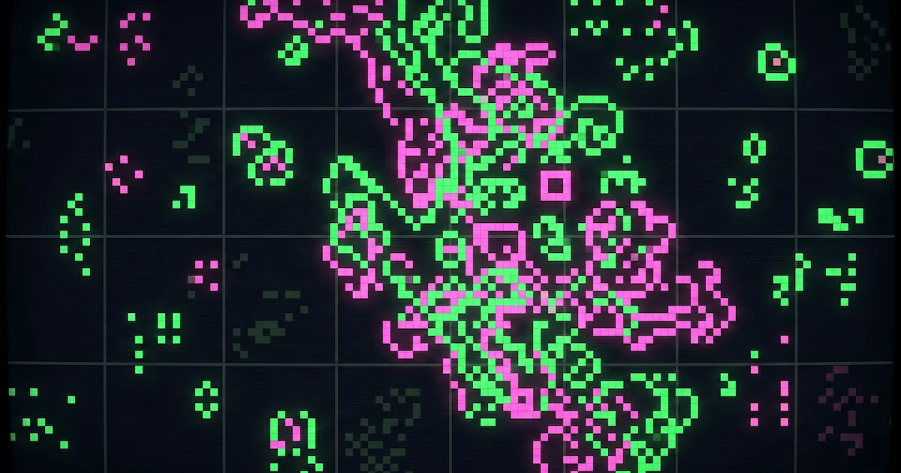

<!-- 
Hero Image AI Prompt:
"A retro, pixelized cellular automaton grid coming to life. Glowing neon green and pink cells on a dark background, representing Conway's Game of Life. 8-bit aesthetic, digital art, generative computer science vibe."
-->

# The Game of Life

Finally! I have been trying to start a dev blog for like 10 years now, and I always found a way to procrastinate that :weary:.

Usually the first thing you do when you start something technology-related is a _Hello World_ of some sort. But this time around, I would like to do something related to generative art, as this blog is going to track all the progress and projects I do regarding that adventure. For that purpose, what better place to start than with _Conway's The Game of Life_! It is sort of the _Hello World_ of generative art after all. (isn't it? :sweat_smile:)

## What is it?

For those of us who thought _The Game of Life_ was an [old family board game created by Milton Bradley](https://en.wikipedia.org/wiki/The_Game_of_Life), we need a little bit more of an introduction to Conway's version. Directly from its [Wikipedia article](https://en.wikipedia.org/wiki/Conway%27s_Game_of_Life):

> The Game of Life is a cellular automaton devised by the British mathematician John Horton Conway in 1970. It is a zero-player game, meaning its evolution is determined entirely by its initial state. You interact with it by creating an initial configuration and observing how it evolves.

Imagine an infinite grid of square cells. Each cell can either be alive or dead. At each step in time, we evaluate the following rules:
1. **Under-population**: A live cell with fewer than two live neighbors dies.
2. **Survival**: A live cell with two or three live neighbors lives on.
3. **Over-population**: A live cell with more than three live neighbors dies.
4. **Reproduction**: A dead cell with exactly three live neighbors becomes alive.

Seems simple enough! But the magic lies in how these simple rules create massive, infinite complexity. So... how do we actually code this? Let's do this!

## The World is Flat

Once we start talking about 2D grids, our minds immediately jump to 2D arrays (e.g., `state[x][y]`). But here is the gotcha: **there is no such thing as a 2D array for a computer**. They are just mathematical constructs! Usually, the most resource-intensive part of graphics sketches is rendering, and traversing nested arrays pixel-by-pixel is slow.

Instead, let's use **1D arrays**. This is how frame buffers represent images natively. And here is the coolest part: 1D arrays are already toroidally bound on the X-axis! :astonished: What does that mean? It means if `x == width` and we do `x + 1`, instead of throwing an `Out of Bounds` error like a 2D array would, it seamlessly drops down to the first item of the next row. Just like Pac-Man going out one side of the screen and coming out the other! (Albeit a row below).

## The Setup

We are going to use [p5.js](https://p5js.org/) for this. Instead of a standard 2D array, let's declare our single 1D array to represent our grid state. Because we are iterating manually, tracking neighbor offsets is drastically simplified to a static array of indices!

<<< @/posts/the-game-of-life/simple-life.js#setup

## Initialization

In a 2D array, randomly seeding live cells means looping over `X` and `Y` and rolling a dice for each cell (like flipping a coin). This usually nets you exactly ~50% alive/dead population. 

But with 1D arrays? We can just calculate the literal *number* of cells we want alive based on a percentage, pick `N` random index spots, and turn them on! Faster, simpler, and way more flexible. 

*(A quick gotcha: `p5.js`'s `random()` function returns floating point numbers! So remember to `floor` it before you try indexing your array, or Javascript will be very unhappy).*

<<< @/posts/the-game-of-life/simple-life.js#seed

## The Rules of Life

Every step we must count neighbors and apply Conway's rules. Using our `offset` array from the setup, checking neighbors in a flat list is beautiful. We also use a little helper `at(i)` function to manually wrap the Y-axis toroidally since the 1D array only natively wraps the X-axis for us!

<<< @/posts/the-game-of-life/simple-life.js#helper

Then during each step, we apply the rules to determine the next state of the grid. Giving place to the new generation of cells.

<<< @/posts/the-game-of-life/simple-life.js#step

## Drawing

Because our logic is blazing fast, the rendering is a simple single-loop assignment. 

<<< @/posts/the-game-of-life/simple-life.js#draw

Now check it out!

<Sketch 
  title="Simple Life" 
  source="content/posts/the-game-of-life/simple-life.js"
  description="Click anywhere on the canvas to re-seed it!"
>
  <P5Embed src="./simple-life.js" pixelated />
</Sketch>

## Making it Colorful (and Interactive!)

Okay, there is not much "art" in diminutive black and white pixels dancing around a tiny canvas (or... is there? :thinking:). Thankfully, because we implemented this grid so cleanly, manipulating the visuals is a breeze.

Let's grow the canvas, add some color by mapping the 1D `index` to the HSL hue spectrum (hello instant rainbows! :rainbow:), and let you *interact* with it directly inside the `draw` loop!

<<< @/posts/the-game-of-life/colorful-life.js#draw

There are a little more changes in the code during the setup, but nothing too fancy. Just some extra variables and changes to handle the new features like resolution and scaling to draw the cells as circles instead. The result is a clear winner :trophy:!

<Sketch 
  title="Colorful Life" 
  source="content/posts/the-game-of-life/colorful-life.js"
  description="Click and drag your mouse across the canvas to magically paint new life!"
>
  <P5Embed src="./colorful-life.js" />
</Sketch>

Now we're talking! Try clicking and dragging your mouse across the paused cells above to "paint" new life structures dynamically and watch them explode. 

Experimenting with simple rules that result in infinite complexity is incredibly satisfying. I really enjoyed writing _Life_ and I will definitively keep doing these visual algorithms! In a future post, I might even try pushing this algorithm into WebAssembly with Go to see how many millions of cells we can crank at 60FPS. 

¡Hasta la próxima!
